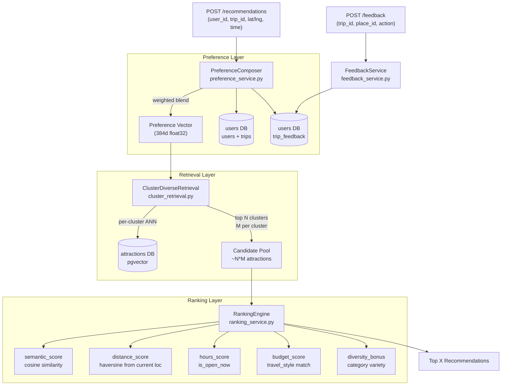

# Attraction Engine Design

## Architecture Overview




## Preference Embedding: How It's Built

The preference vector is a **weighted blend** of three signal sources — no new ML model needed, uses the same `all-MiniLM-L6-v2` already in the engine:


| Source                  | Weight | Data                                                                     |
| ----------------------- | ------ | ------------------------------------------------------------------------ |
| Historical (past trips) | 0.2    | Average of past `user_preference_embeddings` rows (recent trips first)   |
| Trip setup              | 0.5    | Weighted average of per-category embeddings (using preference_breakdown) |
| Real-time feedback      | 0.3    | EMA of liked/skipped attraction embeddings in current session            |


### Trip Setup Embedding

`preference_breakdown` (JSONB) holds category weights, e.g. `{"food": 80, "nature": 60, "art": 30}`. Rather than embedding a flat string (which loses weight information), each category is embedded separately then averaged by its weight:

```python
# Step 1: embed each category with a descriptive phrase
category_phrases = {
    "food":    "food dining restaurants cafes",
    "nature":  "nature parks outdoors greenery",
    "art":     "art museums galleries culture",
    "history": "history monuments heritage sightseeing",
    ...
}
category_embeddings = {cat: embed(category_phrases[cat]) for cat in preference_breakdown}

# Step 2: weighted average using preference_breakdown values
weights = preference_breakdown  # e.g. {"food": 80, "nature": 60, "art": 30}
total = sum(weights.values())
category_vector = sum((w / total) * category_embeddings[cat] for cat, w in weights.items())

# Step 3: embed qualifier text from other user/trip fields
qualifier_text = build_qualifier_text(user, trip)
# e.g. "budget traveler relaxed pace with kids walking"
qualifier_vector = embed(qualifier_text)

# Step 4: blend category vector (dominant) with qualifier vector
trip_vector = 0.80 * category_vector + 0.20 * qualifier_vector
```

`**build_qualifier_text**` constructs a short phrase from:

- `travel_style` → `"budget"` / `"balanced"` / `"premium"`
- `pace_preference` → `"relaxed pace"` / `"normal pace"` / `"fast pace"`
- `with_kids` → `"with kids"` (if True)
- `dietary_style` → `"vegan"` / `"kosher"` / etc.
- `preferred_transportation` → `"walking"` / `"public transport"` / `"taxi"`

The resulting `preference_text` stored for debugging = `qualifier_text` + category list sorted by weight.

### Attraction History / Exclusions

Visited and skipped attractions are excluded at the SQL retrieval level by passing the set of `place_id`s from `trip_feedback` as a `NOT IN (...)` filter. This prevents ever surfacing an attraction the user has already acted on during the current trip. Liked attractions are kept as EMA signal but also excluded from re-recommendation.

## Cluster-Diverse Retrieval

Instead of a single ANN query, the engine queries each `location_cluster` separately:

1. For each cluster in the current location: run `pgvector <=>` cosine search scoped to that `location_cluster_id` → top-M per cluster
2. Score each cluster by its best candidate's similarity to preference vector
3. Select top-N clusters (configurable, e.g. `N=5`)
4. Final candidate pool: `N * M` attractions (e.g. 25–50)

This ensures variety across attraction types rather than returning 10 coffee shops.

## Ranking Scoring Formula

```
final_score = (
    0.40 * semantic_score       # cosine similarity to preference vector
  + 0.25 *hours_score           # 1.0 if open now, 0.5 if unknown, 0.0 if closed
  + 0.20 * distance_score       # 1 - (dist_km / max_walk_km), floored at 0
  + 0.10 * budget_score         # 1.0 if budget matches travel_style
  + 0.05 * diversity_bonus      # bonus for categories not yet in results
)
```

Weights are configurable constants, easily tunable.

## Feedback Loop

- `POST /feedback` accepts `{trip_id, place_id, action: "liked" | "skipped" | "visited"}`
- Persisted in a new `trip_feedback` table (see DB changes below)
- `FeedbackService` updates the real-time EMA in-session and returns a refreshed preference vector
- Next `/recommendations` call picks up the updated embedding

## DB Changes (new migration `003`)

`**trip_feedback` table** (in `users` DB):

```sql
CREATE TABLE trip_feedback (
    id SERIAL PRIMARY KEY,
    trip_id INTEGER NOT NULL REFERENCES trips(trip_id) ON DELETE CASCADE,
    place_id TEXT NOT NULL,
    action VARCHAR(10) CHECK (action IN ('liked', 'skipped', 'visited')),
    created_at TIMESTAMPTZ DEFAULT NOW()
);
```

`**user_preference_embeddings` table** (in `users` DB) — one row per trip, enabling historical blending:

```sql
CREATE TABLE user_preference_embeddings (
    id SERIAL PRIMARY KEY,
    user_id INTEGER NOT NULL REFERENCES users(id) ON DELETE CASCADE,
    trip_id INTEGER REFERENCES trips(trip_id) ON DELETE SET NULL,
    preference_text TEXT,        -- human-readable text that was embedded (for debugging)
    embedding vector(384) NOT NULL,
    created_at TIMESTAMPTZ DEFAULT NOW()
);
CREATE INDEX ON user_preference_embeddings(user_id);
CREATE INDEX ON user_preference_embeddings(trip_id);
```

- One row is inserted/updated per trip (active session embedding, updated by EMA as feedback arrives)
- Past trip rows are used as the historical signal source in `PreferenceComposer`
- `preference_text` makes it debuggable (inspect what text generated the embedding)

## Files to Create / Modify

- `[database/migrations/003_feedback_and_pref_embedding.sql](database/migrations/003_feedback_and_pref_embedding.sql)` — `trip_feedback` table + `preference_embedding` column
- `[engine/src/services/preference_service.py](engine/src/services/preference_service.py)` — compose weighted preference vector
- `[engine/src/services/cluster_retrieval.py](engine/src/services/cluster_retrieval.py)` — per-cluster ANN retrieval
- `[engine/src/services/ranking_service.py](engine/src/services/ranking_service.py)` — scoring and ranking
- `[engine/src/services/feedback_service.py](engine/src/services/feedback_service.py)` — persist and apply feedback
- `[engine/src/db/user_queries.py](engine/src/db/user_queries.py)` — load user + trip from users DB
- `[engine/src/db/feedback_queries.py](engine/src/db/feedback_queries.py)` — read/write trip_feedback
- `[engine/src/db/cluster_queries.py](engine/src/db/cluster_queries.py)` — per-cluster pgvector queries
- `[engine/src/internal-routes/recommendations.py](engine/src/internal-routes/recommendations.py)` — `POST /recommendations` + `POST /feedback` routes
- `[shared/python/models/recommendation.py](shared/python/models/recommendation.py)` — update request/response models

## Model Choices Summary


| Component                | Model / Method                                                  |
| ------------------------ | --------------------------------------------------------------- |
| Preference embedding     | `all-MiniLM-L6-v2` (already loaded) — no new dependency         |
| Preference blending      | Weighted average of embedding vectors (numpy)                   |
| Cluster ranking          | Dot product of cluster centroid vs preference vector            |
| Attraction ranking       | Weighted scoring function (pure math, no ML)                    |
| Preference re-evaluation | Exponential Moving Average (EMA), alpha configurable per source |


