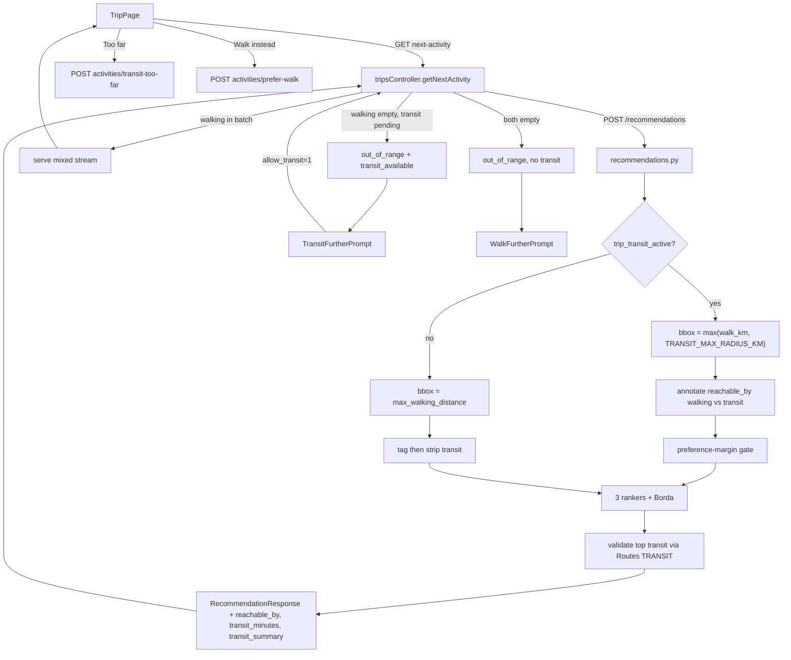

# Public Transport-Aware Recommendations

## What this document covers

How the recommendation pipeline was extended so a trip can suggest high-match attractions that are a **short public-transport ride** beyond the walking radius, not only places the user can walk to.

It covers:

1. How candidate fetch used to be walking-only
2. The widened search, walking vs transit tagging, ranking gate, and Google Routes validation
3. How the API splits walking vs transit and when the UI shows which prompt
4. Per-card "Too far" / "I'd rather walk" and how those persist
5. Every file that changed for this feature
6. Config, tests, and why you can still see the old "Not enough nearby attractions" walking prompt

---

## Goal

Walking suggestions stay the default. In addition, surface attractions that are:

- farther than `trip.max_walking_distance`, but
- still inside `TRANSIT_MAX_RADIUS_KM` (default 5 km), and
- reachable by public transport in at most `trip.max_travel_time_min` (schema default 30 minutes)

Those places are marked in the UI. The user can reject a ride as **Too far** (shrink the time cap) or **I'd rather walk** (skip this transit card; next card should be walkable; transit can come back later).

Transit is **not** gated on `preferred_transportation`. The wizard transport type still only affects preference-embedding text. The overlay is on when the global flag is enabled and the trip still allows a positive travel-time cap.

---

## How it worked before

- [`engine/src/db/cluster_queries.py`](../engine/src/db/cluster_queries.py) sized the SQL bounding box by `trip.max_walking_distance` only. Places outside that walk radius were never fetched, so they could never be ranked.
- Distance was scored `1 - dist / max_walk_km` (Haversine) in [`engine/src/services/ranking_utils.py`](../engine/src/services/ranking_utils.py) and fused across the three rankers + Borda voter.
- `trips.preferred_transportation` (`walking` / `public` / `taxi`) and `trips.max_travel_time_min` already existed in [`database/init.sql`](../database/init.sql) (`max_travel_time_min INTEGER DEFAULT 30`) but only affected embedding text.
- When walking options ran out, the app showed **Walk a bit further?** ([`WalkFurtherPrompt.tsx`](../web/src/components/WalkFurtherPrompt.tsx) + `POST /:id/expand-range`), which persists a larger `max_walking_distance` and refetches.

There was nothing to "rank cheaply" beyond walking distance, because those places were never in the candidate pool.

---

## How it works now

### 1. Widen the fetch, then classify

When transit is active for the trip, the engine sets

```text
search_radius_km = max(max_walking_distance, TRANSIT_MAX_RADIUS_KM)
```

and passes that into cluster retrieval. The SQL bbox uses `search_radius_km` (falling back to walk distance when transit is off). The shortlist is still cluster-diverse (up to 10 clusters × 5 per cluster), not the whole city.

After fetch, each candidate is tagged with Haversine vs `max_walking_distance`:

| Tag | Meaning |
|-----|---------|
| `reachable_by: walking` | distance ≤ walking radius |
| `reachable_by: transit` | farther than walking, still inside the search radius |

Cheap ranking then runs on this **widened** shortlist. Google Routes is called later, and only for the top few **transit-tagged** candidates.

Transit is **off** for a trip when:

- `TRANSIT_SUGGESTIONS_ENABLED` is false, or
- `trip.max_travel_time_min` is `NULL` or `≤ 0`

If it is off, the bbox stays walking-only and any transit-tagged rows are stripped before ranking. That is why an existing trip with `max_travel_time_min = 0` (or `NULL` on a DB that did not apply the default) still behaves like the old walking-only engine.

`I'd rather walk` does **not** shrink the bbox. Only `max_travel_time_min = 0` (from **Too far** hitting the floor) disables transit for the rest of that trip.

### 2. Rank with a transit distance penalty + preference-margin gate

For walking candidates, distance score is unchanged: `1 - dist / max_walk_km`.

For transit candidates:

```text
distance_score = TRANSIT_DISTANCE_PENALTY * (1 - dist / TRANSIT_MAX_RADIUS_KM)
```

Default penalty is `0.6`, so a far place only outranks a nearby walk when the preference match is clearly better.

The **preference-margin gate** then drops transit candidates from the mixed stream unless their semantic score beats the best walkable candidate by `TRANSIT_PREFERENCE_MARGIN` (default `0.05`). If the pool has **no** walkable candidates left, the gate keeps all remaining transit candidates (this is what feeds the "go further by transit?" prompt).

### 3. Validate top transit via Google Routes

After the three rankers + Borda vote, [`transit_service.py`](../engine/src/services/transit_service.py) looks up at most `TRANSIT_MAX_DIRECTIONS_CALLS` (default 5) transit-tagged candidates with Google Routes API v2 `computeRoutes` (`travelMode: TRANSIT`).

- Same key as the map: `VITE_GOOGLE_MAPS_API_KEY`. Enable **Maps JavaScript API** and **Routes API** on that key. Routes is a separate SKU from map loads.
- Cache key: rounded origin (`lat,lng` to 3 decimals) + `place_id`.
- Walking candidates pass through with no Routes call.
- Over-time or failed lookups are dropped (unvalidated transit beyond the call cap is also dropped).
- On success, attach `transit_minutes` and `transit_summary` (line names / vehicle / headsign).
- If the key is **missing**, the engine does **not** call Google; it estimates minutes from Haversine at ~20 km/h urban transit so local/dev still works.

The response model ([`shared/python/models/recommendation.py`](../shared/python/models/recommendation.py)) now includes `reachable_by`, `transit_minutes`, and `transit_summary`.

### 4. API: mix walking, hold leftover transit, prompt when walking is empty

[`getNextActivity`](../api/src/controllers/tripsController.js) still caches a batch from `POST /recommendations/`. After a fetch it splits:

- **walking** = `reachable_by !== 'transit'` (missing tag counts as walking)
- **transit** = `reachable_by === 'transit'`

Behavior:

| Engine batch | What the API does |
|--------------|-------------------|
| Some walking | Serve the mixed batch immediately (gated transit can appear in the stream). |
| No walking, some transit, user has not opted in | Hold transit in `pendingTransit`, return `activity: null`, `out_of_range: true`, `transit_available: true`. |
| No walking, some transit, `?allow_transit=1` | Serve the held transit batch. |
| Neither | `out_of_range: true`, `transit_available: false` (this is the old walking prompt). |

`activityMapper` passes `reachableBy`, `transitMinutes`, `transitSummary` through to the web Activity shape.

### 5. User-facing UI

**On a transit card** ([`ActivityCard.tsx`](../web/src/components/ActivityCard.tsx)):

- Badge: `~N min by public transport` plus optional `transitSummary`
- **Too far** and **I'd rather walk**
- Map uses `TravelMode.TRANSIT` ([`MapView.tsx`](../web/src/components/MapView.tsx))

**When walking is exhausted but `transit_available`:** [`TransitFurtherPrompt.tsx`](../web/src/components/TransitFurtherPrompt.tsx)

- "Suggest places a short ride away" → `GET next-activity?allow_transit=1`
- Optional "Enlarge walking distance instead" (same expand-range path as before)
- "Try again later / finish trip"

**When walking is exhausted and there is no pending transit:** the existing [`WalkFurtherPrompt.tsx`](../web/src/components/WalkFurtherPrompt.tsx) ("Not enough nearby attractions / within X km").

Web flag: `featureFlags.transitSuggestions.enabled` in [`web/src/config/featureFlags.ts`](../web/src/config/featureFlags.ts). If that is off, the UI never shows the transit prompt even if the API set `transit_available`.

---

## Too far vs I'd rather walk

### Too far — `POST /api/trips/:id/activities/transit-too-far`

1. Record a skip on that `place_id`.
2. Subtract `TRANSIT_TOO_FAR_STEP_MIN` (default 10) from `max_travel_time_min`, floored at 0 (`computeReducedTravelTime` in [`api/src/utils/travelTime.js`](../api/src/utils/travelTime.js)). Typical path: 30 → 20 → 10 → 0.
3. Clear the recommendation cache.
4. At 0, `trip_transit_active` is false: bbox goes back to walking-only **for this trip**.

### I'd rather walk — `POST /api/trips/:id/activities/prefer-walk`

1. Record a skip on that transit `place_id`.
2. Set a **one-shot** `preferWalkOnce` flag for the trip (in-memory on the API process).
3. **Does not** change `max_travel_time_min`. Transit stays enabled.
4. The next `getNextActivity` promotes the next walking rec in the cache (or refetches). If nothing walkable remains, leftover transit is moved back to `pendingTransit` and the client can see the transit prompt rather than being forced onto another ride.

---

## Data flow



---

## Files changed

### Engine

| File | What changed |
|------|----------------|
| [`engine/src/services/transit_config.py`](../engine/src/services/transit_config.py) | **New.** Env-backed flags/caps; `trip_transit_active()`; `trip_max_travel_time_min()` (NULL → 30 for the cap, but active check still requires a stored value `> 0`). |
| [`engine/src/services/transit_service.py`](../engine/src/services/transit_service.py) | **New.** Google Routes TRANSIT lookup, summary parser (nested line/vehicle names), cache, estimate fallback when the key is empty. |
| [`engine/src/db/cluster_queries.py`](../engine/src/db/cluster_queries.py) | Bounding box uses `search_radius_km` when provided. |
| [`engine/src/services/cluster_retrieval.py`](../engine/src/services/cluster_retrieval.py) | Threads `search_radius_km` into the SQL query. |
| [`engine/src/services/ranking_utils.py`](../engine/src/services/ranking_utils.py) | `annotate_reachability`, transit distance score, `apply_transit_preference_gate`. |
| [`engine/src/services/maxmin_ranker.py`](../engine/src/services/maxmin_ranker.py) | Ignore `reachable_by` when picking the worst scoring dimension. |
| [`engine/src/internal-routes/recommendations.py`](../engine/src/internal-routes/recommendations.py) | Compute `search_radius_km`; annotate/gate or strip; validate transit after voting; fill new response fields. |
| [`engine/tests/test_transit_ranking.py`](../engine/tests/test_transit_ranking.py) | **New.** Distance penalty, tagging, preference gate. |

### Shared

| File | What changed |
|------|----------------|
| [`shared/python/models/recommendation.py`](../shared/python/models/recommendation.py) | `reachable_by`, `transit_minutes`, `transit_summary` on `RecommendationResponse`. |

### API

| File | What changed |
|------|----------------|
| [`api/src/utils/activityMapper.js`](../api/src/utils/activityMapper.js) | Pass-through transit fields. |
| [`api/src/utils/travelTime.js`](../api/src/utils/travelTime.js) | **New.** Pure helper for shrinking `max_travel_time_min`. |
| [`api/src/controllers/tripsController.js`](../api/src/controllers/tripsController.js) | Walking/transit split, `pendingTransit`, `allow_transit`, `transit_available`; `markTransitTooFar`; `preferWalk` + `preferWalkOnce`. |
| [`api/src/routes/trips.js`](../api/src/routes/trips.js) | `POST /:id/activities/transit-too-far`, `POST /:id/activities/prefer-walk`. |
| [`api/tests/activityMapper.test.js`](../api/tests/activityMapper.test.js) | Transit metadata mapping. |
| [`api/tests/travelTime.test.js`](../api/tests/travelTime.test.js) | **New.** Too-far step / floor. |

### Web

| File | What changed |
|------|----------------|
| [`web/src/config/featureFlags.ts`](../web/src/config/featureFlags.ts) | `transitSuggestions { enabled, maxRadiusKm }`. |
| [`web/src/types/trip.ts`](../web/src/types/trip.ts) | `reachableBy`, `transitMinutes`, `transitSummary`; `transitAvailable` on next-activity. |
| [`web/src/services/tripService.ts`](../web/src/services/tripService.ts) | Map new fields; `allow_transit` query; `markTransitTooFar`; `preferWalk`. |
| [`web/src/components/ActivityCard.tsx`](../web/src/components/ActivityCard.tsx) | Transit badge + Too far / I'd rather walk. |
| [`web/src/components/MapView.tsx`](../web/src/components/MapView.tsx) | `travelMode: 'walking' \| 'transit'`. |
| [`web/src/components/TransitFurtherPrompt.tsx`](../web/src/components/TransitFurtherPrompt.tsx) | **New.** Prompt when walking is exhausted but transit remains. |
| [`web/src/pages/TripPage.tsx`](../web/src/pages/TripPage.tsx) | Choose Transit vs Walk prompt; accept-transit refetch; wire card actions. |

### Docs / env

| File | What changed |
|------|----------------|
| [`.env.example`](../.env.example) | `TRANSIT_*` block; note that Routes API must be enabled on `VITE_GOOGLE_MAPS_API_KEY`. |
| [`README.md`](../README.md) | Short pointer to the shared Maps key + this explanation. |

No database migration. Existing columns `max_travel_time_min` and `preferred_transportation` are reused. The wizard still does not send `max_travel_time_min` on create; new rows rely on the DB default of 30.

---

## Config (`.env.example`)

| Variable | Default | Role |
|----------|---------|------|
| `TRANSIT_SUGGESTIONS_ENABLED` | `true` | Global kill switch (engine). |
| `TRANSIT_MAX_RADIUS_KM` | `5` | Hard candidate search cap around the user. |
| `TRANSIT_DISTANCE_PENALTY` | `0.6` | Multiplier on transit distance score (0–1). |
| `TRANSIT_PREFERENCE_MARGIN` | `0.05` | Semantic margin vs best walkable for the mixed stream. |
| `TRANSIT_MAX_DIRECTIONS_CALLS` | `5` | Max Routes lookups per recommendation batch. |
| `TRANSIT_TOO_FAR_STEP_MIN` | `10` | Minutes subtracted on "Too far" (API). |
| `VITE_GOOGLE_MAPS_API_KEY` | — | Map JS + engine Routes TRANSIT. |

If `TRANSIT_*` is omitted from a local `.env`, the engine still uses the defaults above (`enabled = true`, radius 5 km).

---

## Tests

```bash
# Engine ranking / tagging / gate
# (from the engine container or with PYTHONPATH set)
python -m pytest engine/tests/test_transit_ranking.py

# API mapper + too-far helper
node --test api/tests/activityMapper.test.js
node --test api/tests/travelTime.test.js
```

---

## Why you can still see "Not enough nearby attractions / within 1 km"

That copy is **WalkFurtherPrompt**. It is shown when the next-activity response is `out_of_range` **without** `transit_available` (or when the web `transitSuggestions` flag is off).

Adding public transport does **not** replace that screen. The transit prompt only appears when the engine actually returned transit-tagged recs and the API parked them in `pendingTransit`.

Typical reasons the walking prompt still appears:

1. **Transit is off for this trip.** `max_travel_time_min` is `NULL` or `0`. Then the bbox stays at 1 km, nothing beyond walking is fetched, and after walking is exhausted there is no pending transit. New trips should get 30 from the DB default; a trip that hit **Too far** down to 0 (or an older build that zeroed the column on "I'd rather walk") will stay walking-only until that value is positive again.
2. **Nothing survived Routes validation.** The key exists but Routes failed (API not enabled, HTTP error, no TRANSIT itinerary), or every ride exceeded `max_travel_time_min`. Failed lookups are dropped, so the batch can be walking-only even though the 5 km fetch ran.
3. **Nothing in the 5 km box** after hours / already-seen exclusions (GPS far from the destination city, everything closed, all nearby places already skipped).
4. **Preference gate while walking still exists** only affects the mixed stream; once walking is gone, remaining transit should be held for the prompt — unless (1)–(3) emptied them.

What you should see instead when transit worked: **Go a bit further by public transport?** (`TransitFurtherPrompt`), not the 1 km walking message.

---

## Out of scope / notes

- No new trip columns. "Too far" mutates `max_travel_time_min`; "I'd rather walk" is a one-shot cache flag, not a persistent walk-only mode.
- Wizard `preferred_transportation` does not turn this overlay on or off.
- Directions billing: Routes TRANSIT is a paid Maps SKU (~10k free Compute Routes Essentials/month as of implementation). Calls are capped per batch and cached.
- A short-lived `/trip/transit-demo` page was added during development and then removed; the live trip flow is the only UI.
