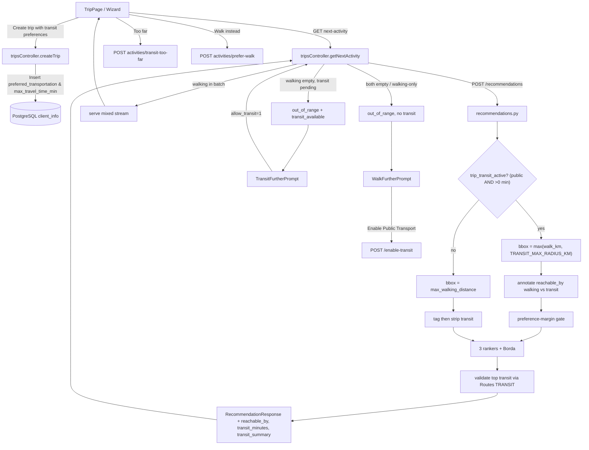

# Public Transport-Aware Recommendations

## What this document covers

How the recommendation pipeline was extended so a trip can suggest high-match attractions that are a **short public-transport ride** beyond the walking radius, not only places the user can walk to.

It covers:

1. How candidate fetch used to be walking-only
2. The widened search, walking vs transit tagging, ranking gate, and Google Routes validation
3. How the API splits walking vs transit and when the UI shows which prompt
4. Wizard transit configuration, per-card "Too far" / "I'd rather walk", and out-of-attractions recovery
5. Every file that changed for this feature
6. Config, tests, and troubleshooting

---

## Goal

Walking suggestions stay the default. In addition, surface attractions that are:

- farther than `trip.max_walking_distance`, but
- still inside `TRANSIT_MAX_RADIUS_KM` (default 5 km), and
- reachable by public transport in at most `trip.max_travel_time_min` (configured in the Wizard or prompt, default 30 minutes)

Those places are marked in the UI. The user can reject a ride as **Too far** (shrink the time cap) or **I'd rather walk** (skip this transit card; next card should be walkable; transit can come back later).

Transit is gated on `preferred_transportation` and `max_travel_time_min`. If the user selects "No, walking only" in the Trip Wizard, `preferred_transportation = 'walking'` and `max_travel_time_min = 0`, keeping recommendations strictly walking-only. If the user selects "Yes, allow transit", `preferred_transportation = 'public'` and `max_travel_time_min = <slider_value>`.

---

## How it worked before

- [`engine/src/db/cluster_queries.py`](../engine/src/db/cluster_queries.py) sized the SQL bounding box by `trip.max_walking_distance` only. Places outside that walk radius were never fetched, so they could never be ranked.
- Distance was scored `1 - dist / max_walk_km` (Haversine) in [`engine/src/services/ranking_utils.py`](../engine/src/services/ranking_utils.py) and fused across the three rankers + Borda voter.
- `trips.preferred_transportation` (`walking` / `public` / `taxi`) and `trips.max_travel_time_min` already existed in [`database/init.sql`](../database/init.sql) (`max_travel_time_min INTEGER DEFAULT 30`) but only affected embedding text.
- When walking options ran out, the app showed **Walk a bit further?** ([`WalkFurtherPrompt.tsx`](../web/src/components/WalkFurtherPrompt.tsx) + `POST /:id/expand-range`), which persists a larger `max_walking_distance` and refetches.

There was nothing to "rank cheaply" beyond walking distance, because those places were never in the candidate pool.

---

## How it works now

### 1. Widen the fetch, then classify

When transit is active for the trip (`preferred_transportation == 'public'` and `max_travel_time_min > 0`), the engine sets:

```text
search_radius_km = max(max_walking_distance, TRANSIT_MAX_RADIUS_KM)
```

and passes that into cluster retrieval. The SQL bbox uses `search_radius_km` (falling back to walk distance when transit is off). The shortlist is still cluster-diverse (up to 10 clusters × 5 per cluster), not the whole city.

After fetch, each candidate is tagged with Haversine vs `max_walking_distance`:

| Tag | Meaning |
|-----|---------|
| `reachable_by: walking` | distance ≤ walking radius |
| `reachable_by: transit` | farther than walking, still inside the search radius |

Cheap ranking then runs on this **widened** shortlist. Google Routes is called later, and only for the top few **transit-tagged** candidates.

Transit is **off** for a trip when:

- `TRANSIT_SUGGESTIONS_ENABLED` is false, or
- `trip.preferred_transportation` is `'walking'`, or
- `trip.max_travel_time_min` is `NULL` or `≤ 0`

If it is off, the bbox stays walking-only and any transit-tagged rows are stripped before ranking. That is why an existing trip with `max_travel_time_min = 0` or `preferred_transportation = 'walking'` behaves strictly as a walking-only engine.

`I'd rather walk` does **not** shrink the bbox. Only `max_travel_time_min = 0` (from **Too far** hitting the floor or initial walking-only preference) disables transit for the rest of that trip.

### 2. Rank with a transit distance penalty + preference-margin gate

For walking candidates, distance score is unchanged: `1 - dist / max_walk_km`.

For transit candidates:

```text
distance_score = TRANSIT_DISTANCE_PENALTY * (1 - dist / TRANSIT_MAX_RADIUS_KM)
```

Default penalty is `0.6`, so a far place only outranks a nearby walk when the preference match is clearly better.

The **preference-margin gate** then drops transit candidates from the mixed stream unless their semantic score beats the best walkable candidate by `TRANSIT_PREFERENCE_MARGIN` (default `0.05`). If the pool has **no** walkable candidates left, the gate keeps all remaining transit candidates (this is what feeds the "go further by transit?" prompt).

### 3. Validate top transit via Google Routes

After the three rankers + Borda vote, [`transit_service.py`](../engine/src/services/transit_service.py) looks up at most `TRANSIT_MAX_DIRECTIONS_CALLS` (default 5) transit-tagged candidates with Google Routes API v2 `computeRoutes` (`travelMode: TRANSIT`).

- Same key as the map: `VITE_GOOGLE_MAPS_API_KEY`. Enable **Maps JavaScript API** and **Routes API** on that key. Routes is a separate SKU from map loads.
- Cache key: rounded origin (`lat,lng` to 3 decimals) + `place_id`.
- Walking candidates pass through with no Routes call.
- Over-time or failed lookups are dropped (unvalidated transit beyond the call cap is also dropped).
- On success, attach `transit_minutes` and `transit_summary` (line names / vehicle / headsign).
- If the key is **missing**, the engine does **not** call Google; it estimates minutes from Haversine at ~20 km/h urban transit so local/dev still works.

The response model ([`shared/python/models/recommendation.py`](../shared/python/models/recommendation.py)) includes `reachable_by`, `transit_minutes`, and `transit_summary`.

### 4. API: mix walking, hold leftover transit, prompt when walking is empty

[`getNextActivity`](../api/src/controllers/tripsController.js) caches a batch from `POST /recommendations/`. After a fetch it splits:

- **walking** = `reachable_by !== 'transit'` (missing tag counts as walking)
- **transit** = `reachable_by === 'transit'`

Behavior:

| Engine batch | What the API does |
|--------------|-------------------|
| Some walking | Serve the mixed batch immediately (gated transit can appear in the stream). |
| No walking, some transit, user has not opted in | Hold transit in `pendingTransit`, return `activity: null`, `out_of_range: true`, `transit_available: true`. |
| No walking, some transit, `?allow_transit=1` | Serve the held transit batch. |
| Neither | `out_of_range: true`, `transit_available: false` (this is the walking prompt). |

`activityMapper` passes `reachableBy`, `transitMinutes`, `transitSummary` through to the web Activity shape.

### 5. User-facing UI

**In the Trip Wizard** ([`WizardPage.tsx`](../web/src/pages/WizardPage.tsx)):
- **Step 3 (Constraints)**: User is asked "Willing to use public transport for further attractions?" with a Yes/No toggle.
  - If Yes: A slider allows setting the maximum transit travel time (10–60 min, step 5 min, default 30 min) with quick presets (`15m`, `30m`, `45m`, `60m`).
  - If No: Trip is marked `preferred_transportation = 'walking'` and `max_travel_time_min = 0`.
- **Step 4 (Confirmation)**: Displays `Public Transit (up to X min) & Walking (Y km)` or `Walking only (up to Y km)`.

**On a transit card** ([`ActivityCard.tsx`](../web/src/components/ActivityCard.tsx)):
- Badge: `~N min by public transport` plus optional `transitSummary`
- **Too far** and **I'd rather walk**
- Map uses `TravelMode.TRANSIT` ([`MapView.tsx`](../web/src/components/MapView.tsx))

**When walking is exhausted but `transit_available`:** [`TransitFurtherPrompt.tsx`](../web/src/components/TransitFurtherPrompt.tsx)
- "Suggest places a short ride away" → `GET next-activity?allow_transit=1`
- Optional "Enlarge walking distance instead" (same expand-range path as before)
- "Try again later / finish trip"

**When walking is exhausted on a walking-only trip:** [`WalkFurtherPrompt.tsx`](../web/src/components/WalkFurtherPrompt.tsx)
- Offers **Enlarge walking distance** (+1 km)
- Offers **Switch to Public Transport** with an inline slider and presets (`15m`, `30m`, `45m`, `60m`) calling `POST /api/trips/:id/enable-transit` to activate transit and fetch fresh recs.

Web flag: `featureFlags.transitSuggestions.enabled` in [`web/src/config/featureFlags.ts`](../web/src/config/featureFlags.ts).

---

## Too far, I'd rather walk, and Enable Transit

### Too far — `POST /api/trips/:id/activities/transit-too-far`

1. Record a skip on that `place_id`.
2. Subtract `TRANSIT_TOO_FAR_STEP_MIN` (default 10) from `max_travel_time_min`, floored at 0 (`computeReducedTravelTime` in [`api/src/utils/travelTime.js`](../api/src/utils/travelTime.js)). Typical path: 30 → 20 → 10 → 0.
3. Clear the recommendation cache.
4. At 0, `trip_transit_active` is false: bbox goes back to walking-only **for this trip**.

### I'd rather walk — `POST /api/trips/:id/activities/prefer-walk`

1. Record a skip on that transit `place_id`.
2. Set a **one-shot** `preferWalkOnce` flag for the trip (in-memory on the API process).
3. **Does not** change `max_travel_time_min`. Transit stays enabled.
4. The next `getNextActivity` promotes the next walking rec in the cache (or refetches). If nothing walkable remains, leftover transit is moved back to `pendingTransit`.

### Enable Transit — `POST /api/trips/:id/enable-transit`

1. Updates `preferred_transportation = 'public'` and `max_travel_time_min = <minutes>` in the database.
2. Evicts the cached recommendation batch and clears `preferWalkOnce`.
3. Triggers embedding rebuild schedule.
4. The next `getNextActivity` fetches fresh transit-enabled candidates from the engine.

---

## Data flow



---

## Files changed

### Engine

| File | What changed |
|------|----------------|
| [`engine/src/services/transit_config.py`](../engine/src/services/transit_config.py) | Env-backed flags/caps; `trip_transit_active()` checking `preferred_transportation == 'public'` and `max_travel_time_min > 0`. |
| [`engine/src/services/transit_service.py`](../engine/src/services/transit_service.py) | Google Routes TRANSIT lookup, summary parser, cache, estimate fallback. |
| [`engine/src/db/cluster_queries.py`](../engine/src/db/cluster_queries.py) | Bounding box uses `search_radius_km` when provided. |
| [`engine/src/services/cluster_retrieval.py`](../engine/src/services/cluster_retrieval.py) | Threads `search_radius_km` into the SQL query. |
| [`engine/src/services/ranking_utils.py`](../engine/src/services/ranking_utils.py) | `annotate_reachability`, transit distance score, `apply_transit_preference_gate`. |
| [`engine/src/services/maxmin_ranker.py`](../engine/src/services/maxmin_ranker.py) | Ignore `reachable_by` when picking the worst scoring dimension. |
| [`engine/src/internal-routes/recommendations.py`](../engine/src/internal-routes/recommendations.py) | Compute `search_radius_km`; annotate/gate or strip; validate transit after voting. |
| [`engine/src/utils/fallback_coords.py`](../engine/src/utils/fallback_coords.py) | Multi-path fallback resolution for resilient local and docker executions. |
| [`engine/tests/test_transit_ranking.py`](../engine/tests/test_transit_ranking.py) | Distance penalty, tagging, preference gate, and `trip_transit_active` tests. |

### Shared

| File | What changed |
|------|----------------|
| [`shared/python/models/recommendation.py`](../shared/python/models/recommendation.py) | `reachable_by`, `transit_minutes`, `transit_summary` on `RecommendationResponse`. |
| [`shared/fallback_coords.json`](../shared/fallback_coords.json) | Added Hebrew city names (`"תל אביב"`) and database slugs (`"tel_aviv"`, `"ny"`). |

### API

| File | What changed |
|------|----------------|
| [`api/src/utils/activityMapper.js`](../api/src/utils/activityMapper.js) | Pass-through transit fields. |
| [`api/src/utils/travelTime.js`](../api/src/utils/travelTime.js) | Pure helper for shrinking `max_travel_time_min`. |
| [`api/src/controllers/tripsController.js`](../api/src/controllers/tripsController.js) | Persists `max_travel_time_min` in `createTrip`; `enableTransit` controller; walking/transit split; `markTransitTooFar`; `preferWalk`. |
| [`api/src/routes/trips.js`](../api/src/routes/trips.js) | `POST /:id/enable-transit`, `POST /:id/activities/transit-too-far`, `POST /:id/activities/prefer-walk`. |
| [`api/tests/activityMapper.test.js`](../api/tests/activityMapper.test.js) | Transit metadata mapping. |
| [`api/tests/travelTime.test.js`](../api/tests/travelTime.test.js) | Too-far step / floor. |

### Web

| File | What changed |
|------|----------------|
| [`web/src/config/featureFlags.ts`](../web/src/config/featureFlags.ts) | `transitSuggestions { enabled, maxRadiusKm }`. |
| [`web/src/types/trip.ts`](../web/src/types/trip.ts) | `allowPublicTransit` and `maxTravelTimeMin` on `TripConstraints`; transit fields on `Activity`. |
| [`web/src/services/tripService.ts`](../web/src/services/tripService.ts) | Send `preferred_transportation` and `max_travel_time_min` on save; `enableTripTransit`. |
| [`web/src/pages/WizardPage.tsx`](../web/src/pages/WizardPage.tsx) | Step 3 Public Transportation toggle & slider; Step 4 Confirmation summary. |
| [`web/src/components/WalkFurtherPrompt.tsx`](../web/src/components/WalkFurtherPrompt.tsx) | Option to switch to Public Transport with slider & presets when walking is exhausted. |
| [`web/src/pages/TripPage.tsx`](../web/src/pages/TripPage.tsx) | `handleEnableTransit`; choose Transit vs Walk prompt; accept-transit refetch. |
| [`web/src/pages/TripsPage.tsx`](../web/src/pages/TripsPage.tsx) & [`web/src/pages/LandingPage.tsx`](../web/src/pages/LandingPage.tsx) | Parse `allowPublicTransit` and `maxTravelTimeMin` for trip editing. |
| [`web/src/components/ActivityCard.tsx`](../web/src/components/ActivityCard.tsx) | Transit badge + Too far / I'd rather walk. |
| [`web/src/components/MapView.tsx`](../web/src/components/MapView.tsx) | `travelMode: 'walking' \| 'transit'`. |
| [`web/src/components/TransitFurtherPrompt.tsx`](../web/src/components/TransitFurtherPrompt.tsx) | Prompt when walking is exhausted but transit remains. |

---

## Config (`.env.example`)

| Variable | Default | Role |
|----------|---------|------|
| `TRANSIT_SUGGESTIONS_ENABLED` | `true` | Global kill switch (engine). |
| `TRANSIT_MAX_RADIUS_KM` | `5` | Hard candidate search cap around the user. |
| `TRANSIT_DISTANCE_PENALTY` | `0.6` | Multiplier on transit distance score (0–1). |
| `TRANSIT_PREFERENCE_MARGIN` | `0.05` | Semantic margin vs best walkable for the mixed stream. |
| `TRANSIT_MAX_DIRECTIONS_CALLS` | `5` | Max Routes lookups per recommendation batch. |
| `TRANSIT_TOO_FAR_STEP_MIN` | `10` | Minutes subtracted on "Too far" (API). |
| `VITE_GOOGLE_MAPS_API_KEY` | — | Map JS + engine Routes TRANSIT. |

---

## Tests

```bash
# Engine ranking / tagging / gate
python -m pytest engine/tests/test_transit_ranking.py

# API mapper + too-far helper
node --test api/tests/activityMapper.test.js
node --test api/tests/travelTime.test.js
```
