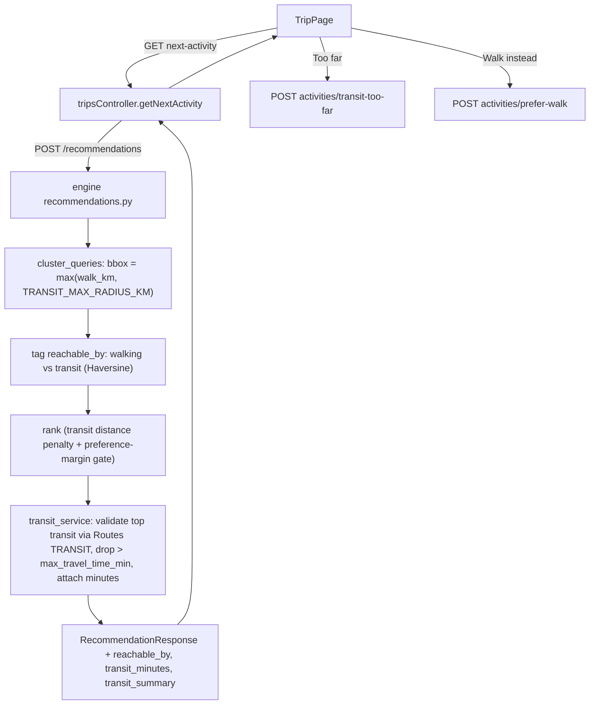

# Public Transport-Aware Recommendations

Augment the recommendation engine to also surface high-value attractions that are a short public-transport ride beyond the walking radius, bounded by a transit radius cap and each trip's `max_travel_time_min` (validated via Google Routes TRANSIT). Transit places are clearly marked in the UI with per-card "Too far" and "I'd rather walk" controls, plus a "Go a bit further by transit?" prompt when walkable options run out.

## Goal

Beyond the current walking-only candidates, also suggest attractions reachable by a short public-transport ride when they are a strong preference match. Bound the search by a transit radius cap and each trip's `max_travel_time_min`. Let the user reject a transit suggestion as "Too far" or ask to "walk instead".

## How it works today (baseline)

- **The engine's candidate pool is walking-only.** [`engine/src/db/cluster_queries.py`](../engine/src/db/cluster_queries.py) sizes a SQL bounding box by `trip.max_walking_distance`. Attractions outside that walk radius are never fetched, so they never get ranked.
- Distance is scored `1 - dist/max_walk` (Haversine) in [`engine/src/services/ranking_utils.py`](../engine/src/services/ranking_utils.py) and fused across 3 rankers.
- `trips.preferred_transportation` (`walking`/`public`/`taxi`) and `trips.max_travel_time_min` already exist ([`database/init.sql`](../database/init.sql)) but only affect embedding text.
- Closest existing pattern: "Walk a bit further?" — `expandWalkingRange` in [`api/src/controllers/tripsController.js`](../api/src/controllers/tripsController.js) + [`WalkFurtherPrompt.tsx`](../web/src/components/WalkFurtherPrompt.tsx): persist a constraint change, clear the rec cache, refetch.

## Prerequisite change: widen the fetch, then classify

Today there is nothing to "rank cheaply" beyond walking distance, because those places are never pulled. The first engine change is to **widen the SQL bounding box** so the shortlist can include both:

1. Walkable places — Haversine distance `<= max_walking_distance`
2. Transit-radius places — farther than walking, but still inside `TRANSIT_MAX_RADIUS_KM` (default 5 km)

That shortlist is still not the whole city (~50 clustered candidates, same as today). After fetch, each candidate is tagged `reachable_by: walking | transit` using Haversine vs `max_walking_distance`. Cheap ranking then runs on **this widened shortlist**. Google Routes is still only called later, and only for the top few **transit-tagged** ones.

## Design decisions (confirmed / assumed)

- Reachability = **backend** Google Routes TRANSIT time, capped by `trip.max_travel_time_min`.
- Candidate fetch widened to a **transit radius cap** (`TRANSIT_MAX_RADIUS_KM`, default 5 km) — this is the hard search-radius limit.
- Surfacing = **both**: high-value transit places mixed into the normal stream (gated), plus a prompt when walkable options are exhausted.
- Transit places get a ranking penalty so they only win when their preference match clearly beats nearby walkable options (the "worth the ride" gate).
- Cost control: after the widened shortlist is ranked with Haversine (no API), only call Directions for the top few **transit-tagged** candidates about to be served (`TRANSIT_MAX_DIRECTIONS_CALLS`, default 5), with an in-memory cache. Walkable candidates skip the Routes API.
- Assumption: transit augmentation is on when the global flag is enabled (independent of `preferred_transportation`); "I'd rather walk" flips the trip to walking for the session. Reuse existing trip columns — no schema migration required.

## Data flow

## Engine changes

- [`engine/src/db/cluster_queries.py`](../engine/src/db/cluster_queries.py): **this is the required first change.** Today `soft_limit_km = max_walk_km`. When transit is enabled, set `soft_limit_km = max(max_walk_km, TRANSIT_MAX_RADIUS_KM)` so places beyond walking distance can enter the pool. Return `latitude/longitude` so callers can classify walking vs transit. If the user chose "I'd rather walk", keep the current walk-only bbox.
- [`engine/src/services/ranking_utils.py`](../engine/src/services/ranking_utils.py): compute `reachable_by` per candidate (Haversine vs `max_walk_km`); for transit candidates score distance as `TRANSIT_DISTANCE_PENALTY * (1 - dist/transit_radius)`; add a preference-margin gate so a transit candidate is only kept in the mixed stream if its semantic score beats the best walkable candidate by `TRANSIT_PREFERENCE_MARGIN`.
- New [`engine/src/services/transit_service.py`](../engine/src/services/transit_service.py): call Google Routes API v2 `computeRoutes` (TRANSIT) for the top `TRANSIT_MAX_DIRECTIONS_CALLS` transit candidates; drop those exceeding `trip.max_travel_time_min`; attach `transit_minutes` + `transit_summary`; in-memory cache keyed by rounded origin + `place_id`.
- [`engine/src/internal-routes/recommendations.py`](../engine/src/internal-routes/recommendations.py): thread transit config + `max_travel_time_min` through; run transit validation after ranking; populate new response fields.
- [`shared/python/models/recommendation.py`](../shared/python/models/recommendation.py): add `reachable_by`, `transit_minutes`, `transit_summary` to `RecommendationResponse`.

## API changes

- [`api/src/utils/activityMapper.js`](../api/src/utils/activityMapper.js): pass through `reachableBy`, `transitMinutes`, `transitSummary`.
- [`api/src/controllers/tripsController.js`](../api/src/controllers/tripsController.js) `getNextActivity`: when the batch is empty (`out_of_range`), probe for transit-reachable candidates and return `transit_available: true` for the prompt.
- Two new endpoints + routes in [`api/src/routes/trips.js`](../api/src/routes/trips.js), mirroring `expandWalkingRange` (persist → clear cache → refetch):
  - `POST /:id/activities/transit-too-far`: record skip; reduce `max_travel_time_min` by `TRANSIT_TOO_FAR_STEP_MIN` (or disable transit at the floor).
  - `POST /:id/activities/prefer-walk`: record skip; set `preferred_transportation='walking'` for the session so subsequent fetches are walkable-only.

## Web changes

- [`web/src/config/featureFlags.ts`](../web/src/config/featureFlags.ts): add `transitSuggestions { enabled, maxRadiusKm }`.
- [`web/src/types/trip.ts`](../web/src/types/trip.ts): extend `Activity` (`reachableBy`, `transitMinutes`, `transitSummary`) and `NextActivityResponse` (`transitAvailable`).
- [`web/src/services/tripService.ts`](../web/src/services/tripService.ts): map new fields; add `markTransitTooFar` and `preferWalk`.
- [`web/src/components/ActivityCard.tsx`](../web/src/components/ActivityCard.tsx) (+ TripPage): transit badge ("~X min by public transport" + `transitSummary`) and, for transit cards, "Too far" and "I'd rather walk" buttons.
- [`web/src/components/MapView.tsx`](../web/src/components/MapView.tsx): use `TravelMode.TRANSIT` for transit cards (currently hardcoded WALKING).
- New [`web/src/components/TransitFurtherPrompt.tsx`](../web/src/components/TransitFurtherPrompt.tsx) (sibling of `WalkFurtherPrompt`) shown when `out_of_range` but `transitAvailable`.
- [`web/src/pages/TripPage.tsx`](../web/src/pages/TripPage.tsx): wire the two card actions and the prompt into the existing next-activity flow.

## Config (`.env.example`)

- `TRANSIT_SUGGESTIONS_ENABLED=true`
- `TRANSIT_MAX_RADIUS_KM=5` (hard candidate search cap)
- `TRANSIT_DISTANCE_PENALTY=0.6`
- `TRANSIT_PREFERENCE_MARGIN=0.05`
- `TRANSIT_MAX_DIRECTIONS_CALLS=5`
- `TRANSIT_TOO_FAR_STEP_MIN=10`
- Reuses `VITE_GOOGLE_MAPS_API_KEY` for both the trip map and engine TRANSIT lookups (enable Maps JavaScript API and Routes API on that key).
- Reuses existing `max_travel_time_min` and `preferred_transportation` trip columns — no DB migration.

## Implementation checklist

- Add transit config + feature flags: `.env.example` vars, `web/src/config/featureFlags.ts` `transitSuggestions` block
- Widen candidate bounding box to `max(walk_km, TRANSIT_MAX_RADIUS_KM)` and return coords in `engine/src/db/cluster_queries.py`; classify `reachable_by`
- Add transit distance penalty + preference-margin gate in `engine/src/services/ranking_utils.py` and rankers
- Create `engine/src/services/transit_service.py` (Google Routes TRANSIT validation, `max_travel_time_min` cap, caching); integrate into `recommendations.py`
- Add `reachable_by`, `transit_minutes`, `transit_summary` to `shared/python/models/recommendation.py`
- Pass new fields through `api/src/utils/activityMapper.js` and add `transit_available` to `getNextActivity` out_of_range path
- Add POST `transit-too-far` and `prefer-walk` endpoints + routes mirroring `expandWalkingRange` (persist, clear cache, refetch)
- Extend web types + `tripService.ts` with new fields and `markTransitTooFar` / `preferWalk` calls
- Transit badge + Too far / I'd rather walk buttons on `ActivityCard`, TRANSIT mode in `MapView`, new `TransitFurtherPrompt`, wire into `TripPage`
- Update README / `.env.example` with the transit feature and required Google Routes key

## Out of scope / notes

- No DB schema change; "too far"/"walk instead" reuse existing trip columns and the cache-invalidation pattern.
- Directions billing: transit routing is a paid Maps SKU; calls are capped per batch and cached to stay within the free allowance.
